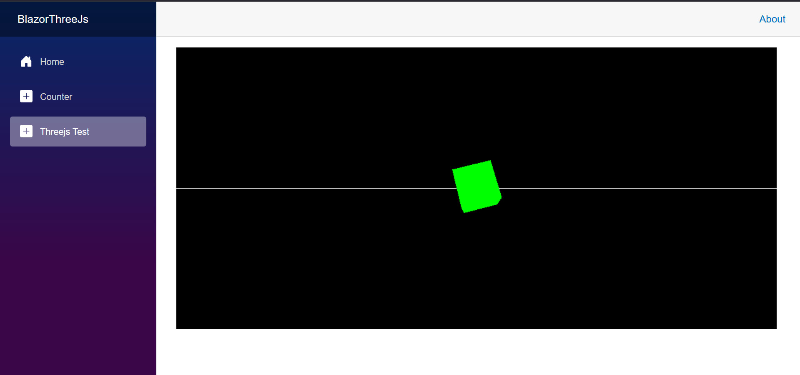
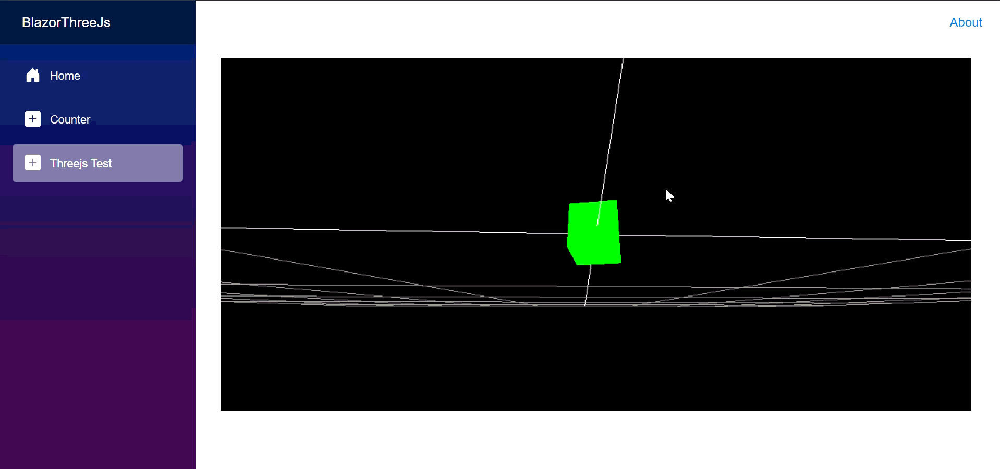

# BlazorThreeJs
BlazorWASM (.net 10).

Wanted to use threejs in blazor without using a nuget package and here's the result.

nothing special but took me longer than it should, I blame myself.
biggest issue to me was how to import threejs to js file
without MIME throwing a fit saying it can't support type ("").

added orbit control as well, but libman doesn't include orbitControl.js
- copy and paste the file from other project
- change its import "from 'three'" to "from 'js/three.js/three.core.js'".
- add it to a script tag in the index.html with type module

Here's a demo of loading a 3d model.
Got it from Sketchfab by user Ojank

Same process as loading but a bit more
- copy and paste GLTFLoader and the util it imports "BufferGeometryUtils.js"
- slight modification to their imports to point to the right place
- slap script tags in the index.html with type module

tried it a higher resolution model and it took a second or two to load.
I should add a loading overlay

I should fix how the canvas is displayed and filled, but that sounds like a headache.
if i tried like in the threejs documentation, part of it goes off screen.
also, setting the position to fixed, fixes some minor annoyance to the side nav menu.

Don't know if I did it the best way, but it works and I'm content for now.
