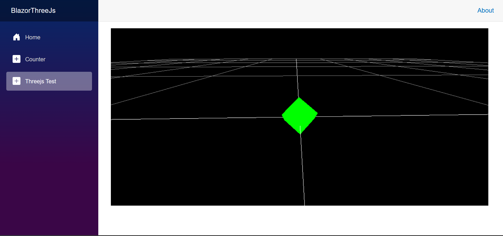

# BlazorThreeJs
BlazorWASM (.net 10).

Wanted to use threejs in blazor without using a nuget package and here's the result.

nothing special but took me longer than it should, I blame myself.
biggest issue to me was how to import threejs to js file
without MIME throwing a fit saying it can't support type ("").

added orbit control as well, but libman doesn't add orbitControl.js anywhere.
So i had to copy and paste the file from other project and change "from 'three'"
to "from 'js/three.js/three.core.js'".

I should fix how the canvas is displayed and filled, but that sounds like a headache.
if i tried like in the threejs documentation, part of it goes off screen.
also, setting the position to fixed, fixes some minor annoyance to the side nav menu.

Don't know if I did it the best way, but it works and I'm content for now.
